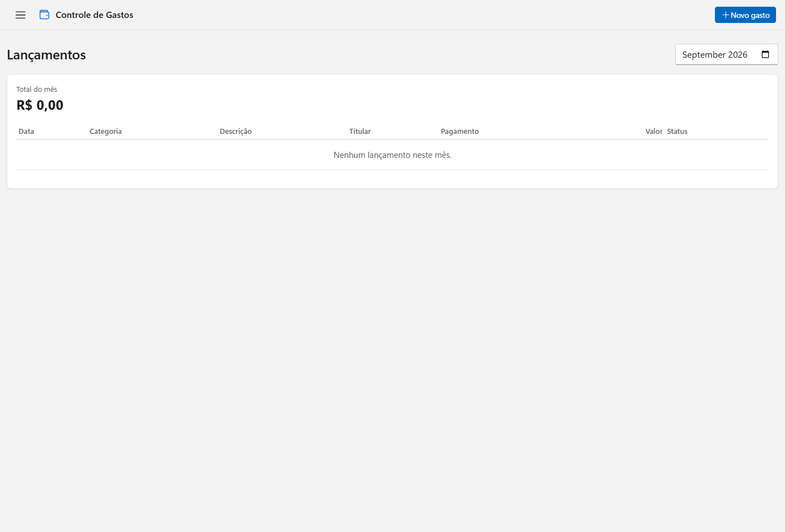
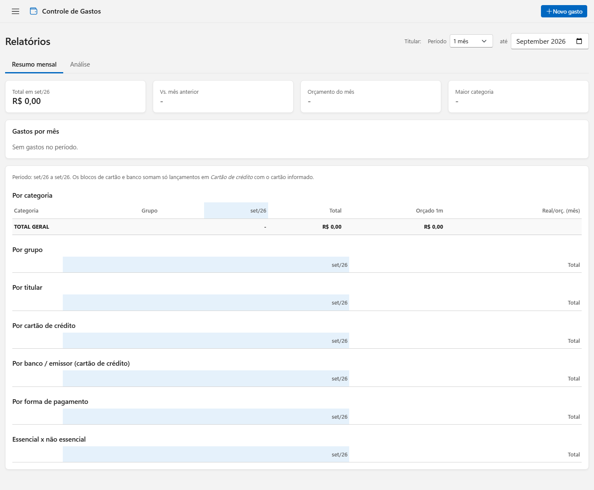
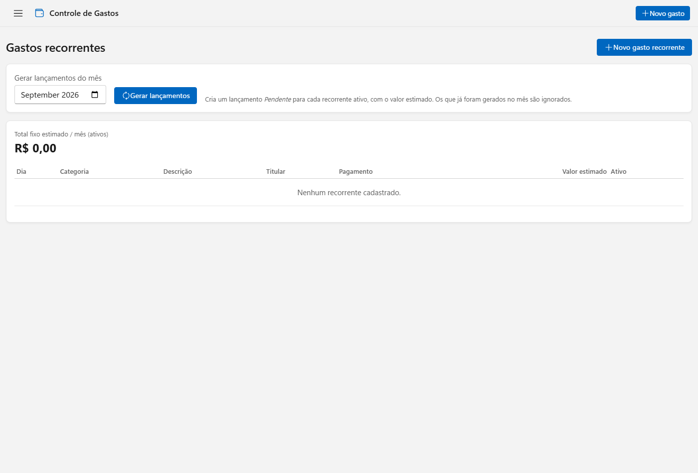
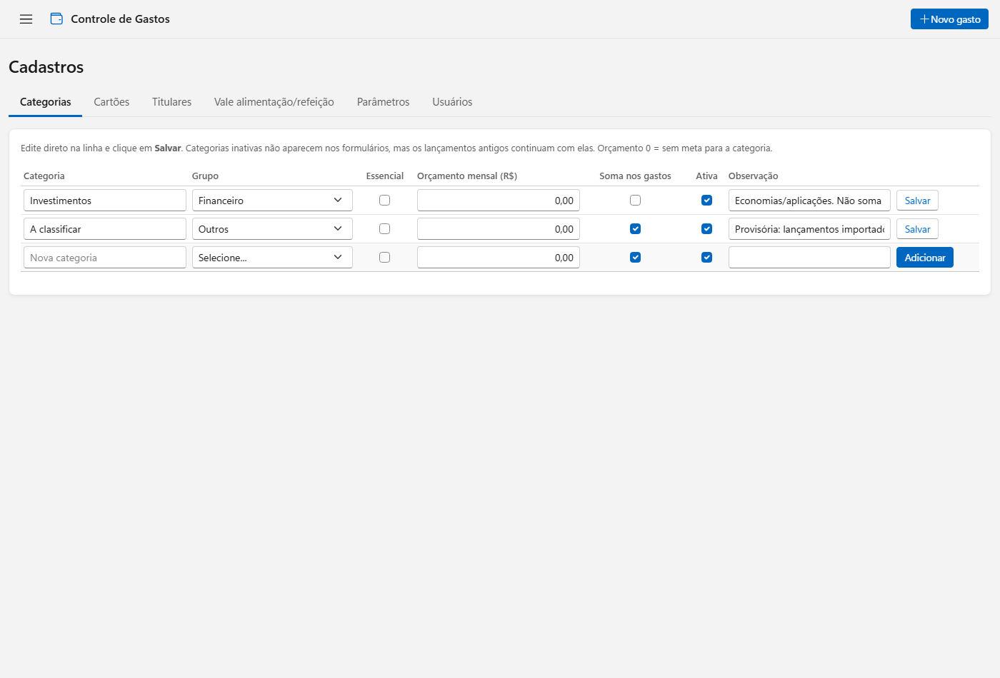

<p align="center">
  
</p>

<h1 align="center">Controle de Gastos</h1>

<p align="center">
  <strong>Self-hosted personal/household finance tracker — transactions, budgets, bank statement import and Telegram alerts</strong>
</p>

<p align="center">
  <a href="LICENSE"></a>
  
  
  
</p>

<p align="center">
  <a href="#features">Features</a> &bull;
  <a href="#screenshots">Screenshots</a> &bull;
  <a href="#installation-docker">Install</a> &bull;
  <a href="#configuration">Configuration</a> &bull;
  <a href="#user-guide">User guide</a> &bull;
  <a href="#telegram-notifications">Telegram</a> &bull;
  <a href="#tests">Tests</a>
</p>

---

Personal/household finance tracker: transactions, recurring bills, budget by category and by person,
bank statement and credit card invoice import, reports with charts, and Telegram notifications. Light/dark
theme following the system, Windows 11-inspired visuals, and a dedicated mobile layout.

The database starts **empty**: no users, categories, cards, or transactions are pre-loaded. After
installing, you create the first user and set everything up from the screens (see
[First access](#first-access) and [User guide](#user-guide)).

## Features

- **Dashboard** for the selected month: total spent, essential spending, pending items, spending vs.
  budget per person and per category, credit cards, meal/food vouchers, and recent months' trend.
- **Reports**: monthly summary with charts (configurable period: 1/3/6/12 months) and analysis (top
  categories, credit card concentration, categories over budget), filterable by person.
- **Transactions**: create, edit, duplicate, delete.
- **Recurring bills**: register fixed monthly expenses and generate the month's pending transactions
  with one click; keywords let them be recognized automatically in imported statements/invoices.
- **Import** bank statements (OFX, CSV, XLSX, PDF) and PDF invoices (including password-protected).
- **To review**: everything coming from an import lands here highlighted, ready to categorize,
  confirm, reconcile, or delete; the system learns from what you confirm.
- **Duplicates**: scans transactions for expenses counted twice (e.g. a PDF invoice and the matching
  card payment also showing up in the bank statement).
- **Registrations**: categories (with a monthly budget and whether they count toward totals), credit
  cards, people/account holders (each with their own monthly budget), meal/food vouchers, general
  parameters, and system users.
- **Fiscal receipt QR reading**: photograph a receipt's QR code and the transaction form opens
  pre-filled with amount, date, and merchant.
- **Telegram notifications** (optional): real-time activity, budget exceeded, large expense, bills due
  soon, and a monthly closing summary — see [Telegram notifications](#telegram-notifications).
- **Username/password login**, with sessions, lockout after failed attempts, and password changes.

## Stack

Python + FastAPI + SQLite (no ORM) + Jinja2 + HTMX + Bootstrap, all served locally (no CDN). No
JavaScript build step. `database/schema.sql` defines the database structure; existing databases are
migrated automatically on startup (`migrar_db()` in `app/database.py`).

## Screenshots

Screens on a freshly installed, empty database (all screen labels are in Portuguese — the app's UI language):

| Transactions | Reports |
|---|---|
|  |  |
| **Recurring bills** | **Registrations** |
|  |  |

## Installation (Docker)

Prerequisite: [Docker](https://docs.docker.com/get-docker/) installed and running.

```bash
git clone <this-repository-url>
cd controle-de-gastos
cp .env.example .env          # optional: adjust port, timezone, backup retention
docker compose up -d --build
```

This starts three services:

```
phone / PC  ->  frontend (nginx)  ->  backend (FastAPI)  ->  db (data + backups)
                port 8080:8080         port 8000, internal      persistent volume
                (the only one published) Compose network only
```

| Service | What it is |
|---|---|
| `frontend` | nginx: serves CSS/icons, rate-limits login attempts, accepts uploads up to 25 MB, and proxies the rest to the backend |
| `backend` | the FastAPI application; no port published directly on the host |
| `db` | data layer: owns the database volume, does a **consistent daily backup**, checks integrity, and enforces retention |

The database is **SQLite** (a single file, not a server); that's why the `db` service doesn't run a
database server — it only holds the volume and the backups. Everything runs **as a non-root user**,
with the backend's filesystem read-only except for the data volume.

### First access

The application starts **closed**: with no user registered, nobody can log in. Create the first one
from the terminal (the password is typed without echoing to the screen):

```bash
docker compose exec backend python -m app.usuarios criar joao --nome "John Doe"
```

Open `http://localhost:8080` (or `http://<machine-ip>:8080` from another device on the same network)
and log in with the user and password you just created.

From there, register everything from the screens (**Cadastros** menu): people/account holders,
categories, credit cards, and, if you want, recurring bills. See the [User guide](#user-guide) below.

> Note: the CLI commands (`app.usuarios`) keep their argument names in Portuguese (`criar`, `--nome`,
> `senha`, `listar`, `desativar`/`ativar`) since the rest of the application's domain language is
> Portuguese; only this README is in English.

### Running without Docker (development)

```bash
python -m venv .venv
.venv\Scripts\activate            # Linux/Mac: source .venv/bin/activate
pip install -r requirements.txt

python -m app.usuarios criar joao --nome "John Doe"
uvicorn app.main:app --reload
```

Open `http://localhost:8000`. The database is created at `data/controle-gastos.db` on first run.

## Configuration

Environment variables (`.env`, see `.env.example`):

| Variable | Default | What it does |
|---|---|---|
| `APP_PORT` | `8080` | App port, the same on the host and inside the frontend container |
| `TZ` | `America/Sao_Paulo` | Timezone (defines "today" and "current month") |
| `COOKIE_SECURE` | `0` | `1` when HTTPS is terminated in front (a proxy); the session cookie then requires HTTPS |
| `ORIGENS_PERMITIDAS` | (empty) | Extra `host:port` values accepted on form submissions, if there's a proxy under another name |
| `BACKUP_HORAS` | `24` | Interval between automatic database backups |
| `BACKUP_RETENCAO_DIAS` | `30` | Backup retention in days (never less than `BACKUP_MINIMO`) |
| `BACKUP_MINIMO` | `7` | Minimum number of backups kept, even beyond the retention window |
| `NOTIFICAR_DETALHES` | `1` | `0` = Telegram notifications only include the category, no amount or description |
| `GASTO_ALTO` | `500` | Amount above which a new transaction triggers an extra Telegram alert; `0` disables it |

## Authentication

- **Username/password login**; the session is stored server-side (cookie `HttpOnly` +
  `SameSite=Lax`). "Keep me signed in" lasts 30 days; without it, the session lasts 12 hours.
- **Every route requires login**, except `/login` and `/static`.
- **Passwords** are hashed with scrypt; minimum 8 characters. 5 consecutive failed attempts lock the
  user out for 15 minutes.
- Each person changes their own password under **My account** (☰ menu → Minha conta); this signs out
  any other device logged in as that user.
- **Managing users**: *Cadastros → Usuários* (create, reset password, deactivate) or from the
  terminal:

```bash
docker compose exec backend python -m app.usuarios listar
docker compose exec backend python -m app.usuarios senha joao       # resets and ends open sessions
docker compose exec backend python -m app.usuarios desativar joao   # / ativar
```

- **POSTs from another origin are rejected** (via the `Origin` header). Behind a proxy under a
  different name, list it in `ORIGENS_PERMITIDAS`.
- **HTTPS**: over plain HTTP, the password travels unencrypted. To expose the app beyond a trusted
  local network, put it behind an HTTPS proxy (Caddy, nginx, Traefik) and set `COOKIE_SECURE=1`.

## User guide

- **Dashboard** (`/`): overview of the selected month — total spent, how much is essential, what's
  pending, spending vs. budget per person and category, credit cards, and meal/food vouchers.
- **Transactions**: the period's expense list, with filters. "Duplicate" creates a new transaction
  with the same data, handy for repeated purchases (e.g. groceries).
- **Import**: upload a bank statement (OFX/CSV/XLSX/PDF) or a PDF invoice. Only outflows from the
  reference month are imported; anything matching a recurring bill's keyword is linked automatically.
- **Revisar → A validar**: transactions coming from an import, flagged for review. Each one can be
  confirmed (with the right category), reconciled against an existing transaction, or deleted.
- **Revisar → Duplicidades**: possible expenses counted twice (e.g. an imported card invoice and its
  payment also showing up in the bank statement). Pick which one to keep, or mark them as "different
  expenses" if it isn't actually a duplicate.
- **Relatórios**: *Resumo mensal* tab (tables by category/group/person/card/bank/payment method, for
  the period chosen in the selector) and *Análise* tab (top categories, card concentration, budget
  overruns).
- **Configurações → Recorrentes**: fixed monthly expenses (rent, subscriptions, loan installments...).
  The "Gerar lançamentos do mês" button creates a pending transaction for every active recurring bill
  that doesn't already have one for the month.
- **Configurações → Cadastros**:
  - **Categorias**: name, group, whether it's essential, monthly budget, and whether it counts toward
    totals (uncheck for categories like savings/investments, which shouldn't count as spending).
  - **Cartões de crédito**: identifier, the account holder who owns the card, issuing bank, and
    keywords (e.g. the card's last digits) to recognize it in imported invoices and statements.
  - **Titulares**: the people who record expenses, each with their own monthly budget (`0` = no
    budget), tracked on the dashboard.
  - **Vale alimentação/refeição**: benefit cards (one per person), each with a monthly amount and
    reload day; expenses paid with this method don't count toward spending totals (it's a benefit,
    not money).
  - **Parâmetros**: monthly savings goal and other general settings.
  - **Usuários**: who can log in (distinct from "titular": a user is who logs in; a titular is who
    the expense belongs to — they may or may not be the same person).
- **Sobre**: installed version and release notes.

### Credit cards: the invoice is the source of truth

Card spending is recorded from the **total of the imported invoice** (category "Cartões de
crédito"). Transactions entered manually with payment method "Cartão de crédito" (including recurring
bills and receipts read via QR code) **don't count** toward totals, to avoid double-counting; they
show up in the list tagged "não soma · na fatura". This applies to the dashboard, reports, category
budgets, and the list total.

### Fixed lists in Cadastros

**Grupo** (categories) and **Banco/Emissor** (cards) are closed lists, defined in `app/listas.py`. To
add a new item, edit that file (or open an issue/PR); a value already saved on a record stays valid
even if later removed from the list.

## Telegram notifications

Optional feature: with no bot configured, everything stays off and the app works normally.

### Setting up the bot

1. On Telegram, talk to **@BotFather** and send `/newbot`. Pick a name and a username for the bot
   (must end in `bot`, e.g. `my_expenses_bot`). It returns a **token** — save it.
2. Send any message to the bot you just created (or add it to a group).
3. Find the **chat id**: open `https://api.telegram.org/bot<TOKEN>/getUpdates` in a browser
   (replacing `<TOKEN>` with the token from step 1) after sending the message from step 2; the
   `"chat":{"id": ...}` field in the response is the chat id.
4. Outside the project folder (so it isn't included in a backup, or synced if the project sits in a
   cloud-synced folder like OneDrive/Dropbox), create these files:
   - `%USERPROFILE%\.controle-gastos\telegram.token` (Windows) or `~/.controle-gastos/telegram.token`
     (Linux/Mac): just the token, no extra line break.
   - `...\telegram.chat`: just the chat id.

`docker-compose.yml` already reads these files as *Docker secrets*. Restart the backend after
creating the files: `docker compose up -d`.

### What each notification does

1. **Activity** (real-time): every time someone creates, edits, or deletes a transaction. Batch
   changes (import, "gerar recorrentes") turn into a single summary instead of one message per item.
   `NOTIFICAR_DETALHES=0` sends only the category, no amount or description.
2. **Budget exceeded** (real-time, alongside the activity notification): when a new or edited
   transaction pushes a category past its monthly budget. Fires only the moment it crosses the line,
   not on every following purchase that's already over.
3. **Large expense** (real-time): a new transaction with an amount ≥ `GASTO_ALTO` (default R$ 500;
   `0` disables it).
4. **Bills due soon** (once a day): warns 3 days before, 1 day before, on the due day, and every day
   while the bill stays unpaid and overdue.
5. **Monthly closing summary** (once a day, only acts on the 1st): previous month's total, change
   from the month before that, % of budget used, categories that went over, and the month's biggest
   expenses.

Notifications 4 and 5 have no built-in scheduler inside the container; run them periodically (cron,
Windows Task Scheduler, or similar):

```bash
docker compose exec -T backend python -m app.lembretes   # every day
docker compose exec -T backend python -m app.resumo      # every day (only acts on the 1st)
```

On Windows, `scripts\lembretes.ps1` and `scripts\resumo.ps1` make that call; an example schedule with
Task Scheduler is in the comments of those scripts.

## Backup and restore

The `db` service backs up automatically every `BACKUP_HORAS` hours, checks each backup's integrity,
and keeps `BACKUP_RETENCAO_DIAS` days of history (never fewer than `BACKUP_MINIMO` copies).

```bash
docker compose exec db backup.sh                                # back up now
docker compose run --rm db restaurar.sh                         # list available backups
docker compose cp db:/backups ./local-backups                   # copy them to your machine
```

**Restore** (the current database is saved first, before being overwritten):

```bash
docker compose stop backend
docker compose run --rm db restaurar.sh controle-gastos-YYYYMMDD-HHMMSS.db
docker compose start backend
```

### Extra off-Docker backup (optional, encrypted)

Besides the backup inside the volume, `scripts/backup-onedrive.ps1` (Windows) copies an **encrypted**
copy into the project's `backups/` folder — useful if that folder is synced by a cloud service
(OneDrive, Dropbox, etc.) as an off-site copy. Before the first run, generate the encryption password
(once only; it's stored outside the project folder and never shown on screen):

```bash
.venv\Scripts\python.exe scripts\gerar_senha_backup.py
```

To restore an encrypted backup: `scripts\cifrar_backup.py decifrar backups\<file>.db.enc` produces
the `.db` next to it, which can then be copied to the volume and restored as above.

## Maintenance and security (Windows scripts)

The scripts under `scripts/` (PowerShell and Python) are optional and aimed at whoever administers a
Windows install; on other systems, use the equivalent `docker compose` commands directly or adapt the
logic to bash/cron.

- `atualizar.ps1`: rebuilds the images with updated base images (Alpine/Python/nginx) and restarts
  without losing data (backs up first). With `-Bibliotecas`, it also audits and regenerates
  `requirements.lock`.
- `auditar.ps1`: scans the images for vulnerabilities (Trivy) and the Python dependencies
  (pip-audit); with `-Notificar`, reports the result via Telegram.
- `backup-onedrive.ps1`, `lembretes.ps1`, `resumo.ps1`: see the sections above.

Production images install the dependencies pinned in `requirements.lock` (exact, audited versions)
and don't ship `pip`.

## Tests

```bash
pip install -r requirements-dev.txt
python -m pytest tests/ -v
```

Each test runs against a temporary SQLite database, isolated from the real one. See `tests/README.md`.

## Project layout

```
/
├── app/
│   ├── main.py                 dashboard, transactions, recurring bills, reports and registration routes
│   ├── rotas_importacao.py     statement/invoice import and the "A validar" screen
│   ├── rotas_duplicidades.py   "Verificar duplicidades" screen
│   ├── beneficios.py           meal/food vouchers: tables and balance calculation
│   ├── rotas_beneficios.py     benefit card registration and use deletion
│   ├── rotas_auth.py           login, logout, my account, users
│   ├── autenticacao.py         sessions, global route protection, security headers
│   ├── seguranca.py            password hashing (scrypt) and password rules
│   ├── avisos.py               Telegram notifications (activity, budget, large expense)
│   ├── lembretes.py            bills-due-soon notification (scheduled)
│   ├── resumo.py               monthly closing summary (scheduled)
│   ├── nota_fiscal.py          receipt QR code: key, Sefaz lookup, memory by CNPJ
│   ├── rotas_nota.py           "Ler QR da nota" (in New transaction)
│   ├── rotas_sobre.py          About screen (version and release notes)
│   ├── versao.py               app version and release notes
│   ├── usuarios.py             terminal command for user management
│   ├── importacao.py           OFX/CSV/XLSX/PDF parsing, PIX detection, etc. (pure functions)
│   ├── duplicidades.py         suspicious pair scoring
│   ├── relatorios.py           report queries (period, filter by titular, chart data)
│   ├── database.py             SQLite connection, database creation and migration
│   ├── templating.py           shared Jinja templates
│   ├── templates/              screens (Jinja2)
│   └── static/                 custom.css (Windows 11 style), icons/, vendor/ (local libraries)
├── database/
│   ├── schema.sql              table structure
│   └── seed.sql                the database starts empty (comments only)
├── docker/
│   ├── frontend/                Dockerfile + nginx.conf.template + proxy_backend.conf
│   ├── backend/Dockerfile
│   └── db/                     Dockerfile + servico.sh, backup.sh, restaurar.sh, saude.sh
├── docker-compose.yml           frontend, backend and db (builds the images from source)
├── scripts/                     optional Windows maintenance scripts (see section above)
├── tests/                       pytest suite
├── .env.example                 documented environment variables
├── requirements.txt             dependencies (version ranges)
├── requirements-dev.txt         extra dependencies to run the tests
└── requirements.lock            exact, audited versions (production images install from this)
```

## Contributing

Issues and pull requests are welcome. Before opening a PR, run the test suite
(`python -m pytest tests/ -v`) and, if possible, an equivalent of `scripts/auditar.ps1`
(`pip-audit`, `trivy image`) to check for vulnerabilities.

## License

MIT — see [LICENSE](LICENSE).
